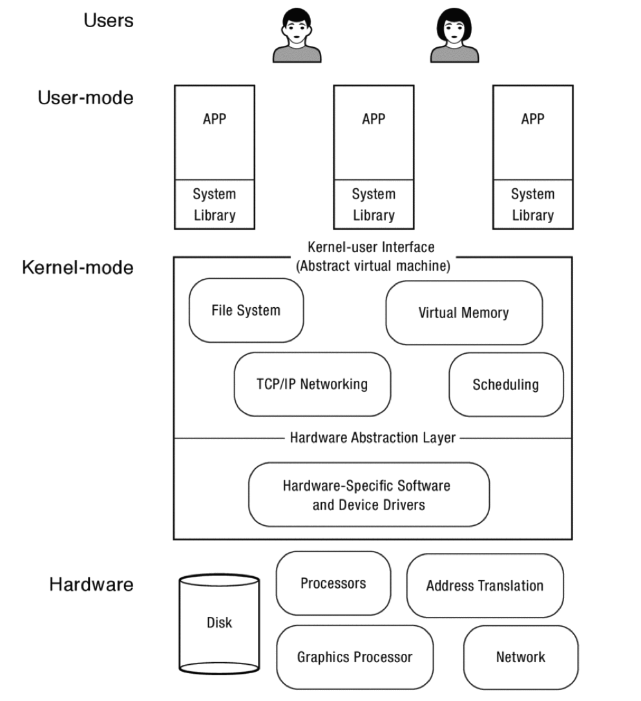
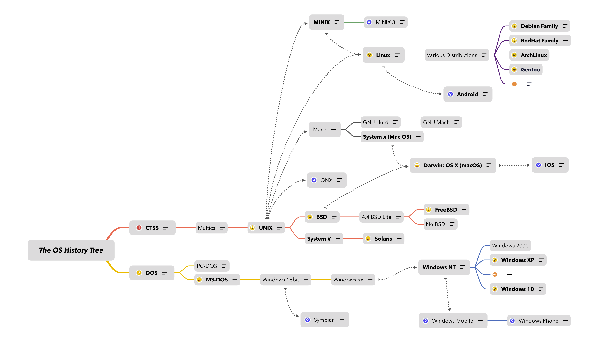

# Sub Chapters

- [What Is An Operating System?](#what-is-an-operating-system?)
- [Operating System Evaluation](#operating-system-evaluation)
- [Operating Systems: Past, Present, and Future](#operating-systems-past-present-and-future)

## What Is An Operating System?

“An operating system (OS) is the layer of software that manages a computer’s resources for its users and their applications.”

Three main pieces:

1. Referee

   1. Manage sharing of resources, Protection, 

      Isolation

      • Resource allocation, isolation, communication

2. Illusionist

   1. Provide clean, easy to use abstractions of 

      physical resources

      • Infinite memory, dedicated machine

      • Higher level objects: files, users, messages

      • Masking limitations, virtualization

3. Glue

   1. Hardware Abstraction Layer

   2.  Common services

      • Storage, Window system, Networking

      • Sharing, Authorization

      • Look and feel

### OS Tool: Virtual Machine Abstraction

- Software Engineering Problem: 
  - Turn hardware/software quirks ⇒what programmers want/need
  - Optimize for convenience, utilization, security, reliability, etc…

-  For any OS area (e.g. file systems, virtual memory, networking, scheduling):
  - What’s the hardware interface? (physical reality)
  - What’s the application interface? (nicer abstraction)

### Process Virtual Machines

- Programming simplicity
  - Each process thinks it has all memory/CPU time
  - Each process thinks it owns all devices
  - Different devices appear to have same high level interface
  - Device interfaces more powerful than raw hardware
    - Bitmapped display ⇒ windowing system
    - Ethernet card ⇒ reliable, ordered, networking (TCP/IP)

- Fault Isolation
  - Processes unable to directly impact other processes
  - Bugs cannot crash whole machine

- Protection and Portability
  - Java interface safe and stable across many platforms

## Operating System Evaluation

### System Virtual Machines: Layers of OSs

- No universally accepted definition
- “Everything a vendor ships when you order an operating system” is good approximation
  - But varies wildly
  - “The one program running at all times on the computer” is the kernel
  - Everything else is either a system program (ships with the operating system) or an application program

## Operating Systems: Past, Present, and Future

- Several Distinct Phases:

  - Hardware Expensive, Humans Cheap 
    - Eniac, … Multics
  - Hardware Cheaper, Humans Expensive 
    - PCs, Workstations, Rise of GUIs

  - Hardware Really Cheap, Humans Really Expensive 
    - Ubiquitous devices, Widespread networking

- Rapid change in hardware leads to changing OS
  - Batch ⇒ Multiprogramming ⇒ Timesharing ⇒ Graphical UI ⇒Ubiquitous Devices
  - Gradual migration of features into smaller machines

- Today
  - Small OS: 100K lines / Large: 10M lines (5M browser!)
  - 100-1000 people-years

